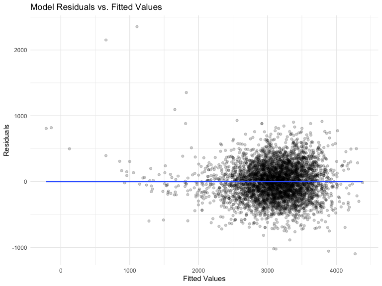

p8105_hw6_lh3109
================

``` r
library(tidyverse)
library(modelr)
library(mgcv)

set.seed(1)

knitr::opts_chunk$set(
  echo = TRUE,
  warning = FALSE,
  fig.width = 8,
  fig.height = 6,
  out.width = "90%"
)

options(
  ggplot2.continuous.colour = "viridis",
  ggplot2.continuous.fill = "viridis"
)

scale_color_discrete = scale_colour_viridis_d
scale_fill_discrete = scale_fill_viridis_d

theme_set(theme_minimal() + theme(legend.position = "bottom"))
```

# Problem 1

## Propose a regression model

### Load and tidy data

``` r
bw_df = 
  #import data
  read_csv("./data/birthweight.csv") %>% 
  #remove possible na values
  drop_na() %>% 
  #factor appropriate numeric variables
  mutate(
    babysex = as.factor(babysex),
    frace = as.factor(frace),
    malform = as.factor(malform),
    mrace = as.factor(mrace)
  )
```

This data set contains 4342 observations with 22 variables. It does not
contains NA values.

### Variable selection

``` r
#test model by considering all variables as predictors
mult_fit = lm(bwt ~ . , data = bw_df)

#using stepwise backward function to select predictors
step(mult_fit, direction = 'backward')
```

    ## Start:  AIC=48717.83
    ## bwt ~ babysex + bhead + blength + delwt + fincome + frace + gaweeks + 
    ##     malform + menarche + mheight + momage + mrace + parity + 
    ##     pnumlbw + pnumsga + ppbmi + ppwt + smoken + wtgain
    ## 
    ## 
    ## Step:  AIC=48717.83
    ## bwt ~ babysex + bhead + blength + delwt + fincome + frace + gaweeks + 
    ##     malform + menarche + mheight + momage + mrace + parity + 
    ##     pnumlbw + pnumsga + ppbmi + ppwt + smoken
    ## 
    ## 
    ## Step:  AIC=48717.83
    ## bwt ~ babysex + bhead + blength + delwt + fincome + frace + gaweeks + 
    ##     malform + menarche + mheight + momage + mrace + parity + 
    ##     pnumlbw + ppbmi + ppwt + smoken
    ## 
    ## 
    ## Step:  AIC=48717.83
    ## bwt ~ babysex + bhead + blength + delwt + fincome + frace + gaweeks + 
    ##     malform + menarche + mheight + momage + mrace + parity + 
    ##     ppbmi + ppwt + smoken
    ## 
    ##            Df Sum of Sq       RSS   AIC
    ## - frace     4    124365 320848704 48712
    ## - malform   1      1419 320725757 48716
    ## - ppbmi     1      6346 320730684 48716
    ## - momage    1     28661 320752999 48716
    ## - mheight   1     66886 320791224 48717
    ## - menarche  1    111679 320836018 48717
    ## - ppwt      1    131132 320855470 48718
    ## <none>                  320724338 48718
    ## - fincome   1    193454 320917792 48718
    ## - parity    1    413584 321137922 48721
    ## - mrace     3    868321 321592659 48724
    ## - babysex   1    853796 321578134 48727
    ## - gaweeks   1   4611823 325336161 48778
    ## - smoken    1   5076393 325800732 48784
    ## - delwt     1   8008891 328733230 48823
    ## - blength   1 102050296 422774634 49915
    ## - bhead     1 106535716 427260054 49961
    ## 
    ## Step:  AIC=48711.51
    ## bwt ~ babysex + bhead + blength + delwt + fincome + gaweeks + 
    ##     malform + menarche + mheight + momage + mrace + parity + 
    ##     ppbmi + ppwt + smoken
    ## 
    ##            Df Sum of Sq       RSS   AIC
    ## - malform   1      1447 320850151 48710
    ## - ppbmi     1      6975 320855679 48710
    ## - momage    1     28379 320877083 48710
    ## - mheight   1     69502 320918206 48710
    ## - menarche  1    115708 320964411 48711
    ## - ppwt      1    133961 320982665 48711
    ## <none>                  320848704 48712
    ## - fincome   1    194405 321043108 48712
    ## - parity    1    414687 321263390 48715
    ## - babysex   1    852133 321700837 48721
    ## - gaweeks   1   4625208 325473911 48772
    ## - smoken    1   5036389 325885093 48777
    ## - delwt     1   8013099 328861802 48817
    ## - mrace     3  13540415 334389119 48885
    ## - blength   1 101995688 422844392 49908
    ## - bhead     1 106662962 427511666 49956
    ## 
    ## Step:  AIC=48709.53
    ## bwt ~ babysex + bhead + blength + delwt + fincome + gaweeks + 
    ##     menarche + mheight + momage + mrace + parity + ppbmi + ppwt + 
    ##     smoken
    ## 
    ##            Df Sum of Sq       RSS   AIC
    ## - ppbmi     1      6928 320857079 48708
    ## - momage    1     28660 320878811 48708
    ## - mheight   1     69320 320919470 48708
    ## - menarche  1    116027 320966177 48709
    ## - ppwt      1    133894 320984044 48709
    ## <none>                  320850151 48710
    ## - fincome   1    193784 321043934 48710
    ## - parity    1    414482 321264633 48713
    ## - babysex   1    851279 321701430 48719
    ## - gaweeks   1   4624003 325474154 48770
    ## - smoken    1   5035195 325885346 48775
    ## - delwt     1   8029079 328879230 48815
    ## - mrace     3  13553320 334403471 48883
    ## - blength   1 102009225 422859375 49906
    ## - bhead     1 106675331 427525481 49954
    ## 
    ## Step:  AIC=48707.63
    ## bwt ~ babysex + bhead + blength + delwt + fincome + gaweeks + 
    ##     menarche + mheight + momage + mrace + parity + ppwt + smoken
    ## 
    ##            Df Sum of Sq       RSS   AIC
    ## - momage    1     29211 320886290 48706
    ## - menarche  1    117635 320974714 48707
    ## <none>                  320857079 48708
    ## - fincome   1    195199 321052278 48708
    ## - parity    1    412984 321270064 48711
    ## - babysex   1    850020 321707099 48717
    ## - mheight   1   1078673 321935752 48720
    ## - ppwt      1   2934023 323791103 48745
    ## - gaweeks   1   4621504 325478583 48768
    ## - smoken    1   5039368 325896447 48773
    ## - delwt     1   8024939 328882018 48813
    ## - mrace     3  13551444 334408523 48881
    ## - blength   1 102018559 422875638 49904
    ## - bhead     1 106821342 427678421 49953
    ## 
    ## Step:  AIC=48706.02
    ## bwt ~ babysex + bhead + blength + delwt + fincome + gaweeks + 
    ##     menarche + mheight + mrace + parity + ppwt + smoken
    ## 
    ##            Df Sum of Sq       RSS   AIC
    ## - menarche  1    100121 320986412 48705
    ## <none>                  320886290 48706
    ## - fincome   1    240800 321127090 48707
    ## - parity    1    431433 321317724 48710
    ## - babysex   1    841278 321727568 48715
    ## - mheight   1   1076739 321963029 48719
    ## - ppwt      1   2913653 323799943 48743
    ## - gaweeks   1   4676469 325562760 48767
    ## - smoken    1   5045104 325931394 48772
    ## - delwt     1   8000672 328886962 48811
    ## - mrace     3  14667730 335554021 48894
    ## - blength   1 101990556 422876847 49902
    ## - bhead     1 106864308 427750598 49952
    ## 
    ## Step:  AIC=48705.38
    ## bwt ~ babysex + bhead + blength + delwt + fincome + gaweeks + 
    ##     mheight + mrace + parity + ppwt + smoken
    ## 
    ##           Df Sum of Sq       RSS   AIC
    ## <none>                 320986412 48705
    ## - fincome  1    245637 321232048 48707
    ## - parity   1    422770 321409181 48709
    ## - babysex  1    846134 321832545 48715
    ## - mheight  1   1012240 321998651 48717
    ## - ppwt     1   2907049 323893461 48743
    ## - gaweeks  1   4662501 325648912 48766
    ## - smoken   1   5073849 326060260 48771
    ## - delwt    1   8137459 329123871 48812
    ## - mrace    3  14683609 335670021 48894
    ## - blength  1 102191779 423178191 49903
    ## - bhead    1 106779754 427766166 49950

    ## 
    ## Call:
    ## lm(formula = bwt ~ babysex + bhead + blength + delwt + fincome + 
    ##     gaweeks + mheight + mrace + parity + ppwt + smoken, data = bw_df)
    ## 
    ## Coefficients:
    ## (Intercept)     babysex2        bhead      blength        delwt      fincome  
    ##   -6098.822       28.558      130.777       74.947        4.107        0.318  
    ##     gaweeks      mheight       mrace2       mrace3       mrace4       parity  
    ##      11.592        6.594     -138.792      -74.887     -100.678       96.305  
    ##        ppwt       smoken  
    ##      -2.676       -4.843

As shown in the output of the step() function, the selected predictors
are babysex, bhead, delwt, fincome, gaweeks, mheight, mrace, parity,
ppwt, and smoken.

### Fit model

Apply the selected predictors to the model

``` r
#fit the model
fit = lm(bwt ~ babysex + bhead + blength + delwt + fincome + 
    gaweeks + mheight + mrace + parity + ppwt + smoken, data = bw_df)

#check the results
summary(fit)
```

    ## 
    ## Call:
    ## lm(formula = bwt ~ babysex + bhead + blength + delwt + fincome + 
    ##     gaweeks + mheight + mrace + parity + ppwt + smoken, data = bw_df)
    ## 
    ## Residuals:
    ##      Min       1Q   Median       3Q      Max 
    ## -1097.18  -185.52    -3.39   174.14  2353.44 
    ## 
    ## Coefficients:
    ##               Estimate Std. Error t value Pr(>|t|)    
    ## (Intercept) -6098.8219   137.5463 -44.340  < 2e-16 ***
    ## babysex2       28.5580     8.4549   3.378 0.000737 ***
    ## bhead         130.7770     3.4466  37.944  < 2e-16 ***
    ## blength        74.9471     2.0190  37.120  < 2e-16 ***
    ## delwt           4.1067     0.3921  10.475  < 2e-16 ***
    ## fincome         0.3180     0.1747   1.820 0.068844 .  
    ## gaweeks        11.5925     1.4621   7.929 2.79e-15 ***
    ## mheight         6.5940     1.7849   3.694 0.000223 ***
    ## mrace2       -138.7925     9.9071 -14.009  < 2e-16 ***
    ## mrace3        -74.8868    42.3146  -1.770 0.076837 .  
    ## mrace4       -100.6781    19.3247  -5.210 1.98e-07 ***
    ## parity         96.3047    40.3362   2.388 0.017004 *  
    ## ppwt           -2.6756     0.4274  -6.261 4.20e-10 ***
    ## smoken         -4.8434     0.5856  -8.271  < 2e-16 ***
    ## ---
    ## Signif. codes:  0 '***' 0.001 '**' 0.01 '*' 0.05 '.' 0.1 ' ' 1
    ## 
    ## Residual standard error: 272.3 on 4328 degrees of freedom
    ## Multiple R-squared:  0.7181, Adjusted R-squared:  0.7173 
    ## F-statistic: 848.1 on 13 and 4328 DF,  p-value: < 2.2e-16

### Plot residuals vs. fitted values

``` r
bw_df %>% 
  modelr::add_residuals(fit) %>% 
  modelr::add_predictions(fit) %>% 
  ggplot(aes(x = pred, y = resid)) +
  geom_point(alpha = 0.2) +
  geom_smooth(method = "lm", se = FALSE, formula = y ~ x) +
  labs(title = "Model Residuals vs. Fitted Values",
       x = "Fitted Values",
       y = "Residuals")
```



As shown in the plot, with fitted value below 2000 or above 4000, the
residuals do not bounce randomly around the 0 line, suggesting that the
data point in this range do not fall on the estimated regression line.
This model is not optimal for data outside of the 2000-4000 range for
fitted values and there are many outliers However, when fitted values
are around 3000, many data points have residuals equals to 0 and they
falls directly on the estimated regression line.

## Compare the model with two others using CV

### Set up training and test subsets

``` r
birthweight_cv = 
  crossv_mc(bw_df, 100) %>% 
  mutate(
    train = map(train, as_tibble),
    test = map(test, as_tibble)
  )
```

### Fit the three models

``` r
birthweight_cv = 
  birthweight_cv %>% 
  mutate(
    mod = map(.x = train, 
              ~lm(bwt ~ babysex + bhead + blength + delwt + fincome + gaweeks + 
                mheight + mrace + parity + ppwt + smoken, 
              data = .x)),
    mod_effects = map(.x = train, ~lm(bwt ~ blength + gaweeks, data = .x)),
    mod_interactions = map(.x = train, ~lm(bwt ~ bhead + blength + babysex + 
                                  bhead * blength + bhead * babysex + 
                                  blength * babysex + bhead * blength * babysex, 
                                data = .x))
  ) %>% 
  mutate(
    #map 2 things, show double value
    rmse_model_proposed = map2_dbl(.x = mod, .y = test, ~rmse(model = .x, data = .y )),
    rmse_model_main_effects = map2_dbl(.x = mod_effects, .y = test, ~rmse(model = .x, data = .y )),
    rmse_model_all_interactions = map2_dbl(.x = mod_interactions, .y = test, ~rmse(model = .x, data = .y ))
  )
```

### Look at the outputs

``` r
birthweight_cv %>% 
  select(.id, starts_with("rmse")) %>% 
  pivot_longer(
    rmse_model_proposed:rmse_model_all_interactions,
    names_to = "model",
    values_to = "rmse",
    names_prefix = "rmse_model_"
  ) %>% 
  ggplot(aes(x = model, y = rmse)) +
  geom_boxplot() +
    labs(title = "Model Comparisons",
       x = "Models",
       y = "RMSE Values")
```


As shown in the plot, the proposed model has much lower rmse values than
the model considering length at birth and gestational age as
predictors(main_effects). It also has lower rmse values than the model
considering head circumference, length, sex and all interactions of
these three variables as predictors(all_interactions). These indicates
that the proposed model is better than the two model compared.

# Prolem 2

## Load data

``` r
weather_df = 
  rnoaa::meteo_pull_monitors(
    c("USW00094728"),
    var = c("PRCP", "TMIN", "TMAX"), 
    date_min = "2017-01-01",
    date_max = "2017-12-31") %>%
  mutate(
    name = recode(id, USW00094728 = "CentralPark_NY"),
    tmin = tmin / 10,
    tmax = tmax / 10) %>%
  select(name, id, everything())
```

## Bootstrapping

### Write a function for one boostrap sample analysis

``` r
boot_sample = function(mod) {
  #find adjusted r square of the estimates
  r_squared = 
    mod %>% 
    broom::glance() %>% 
    pull(adj.r.squared)
  
  #tidy the results of the model
  result = 
    mod %>% 
    broom::tidy()
  
  #pull estimates values for further analysis
  betas = 
    result %>% 
    pull(estimate)
  
  #return a tibble
  tibble(result, r_squared, log_betas = log(betas[1] * betas[2]))
}
```

### Boostrap sample for multiple times

``` r
weather_results = 
  weather_df %>% 
  bootstrap(n = 5000, id = "strap_number") %>% 
    mutate(
    models = map(.x = strap, ~lm(tmax ~ tmin, data = .x)),
    results = map(models, boot_sample)
  ) %>% 
  select(strap_number, results) %>% 
  unnest(results)
```

### Plot distribution of estimates

``` r
weather_results %>% 
  filter(term == "tmin") %>% 
  ggplot(aes(estimate)) +
  geom_density() + 
  labs(title = "Distribution of Estimates",
       x = "Estimate",
       y = "Density")  
```


This plot shows the distribution of the estimates of tmin after
repeating bootstrapping the sample multiple times. The peak is almost
symmetric, indicating that the distribution is approximately normal.

### Plot distribution of R^2

``` r
weather_results %>% 
  ggplot(aes(x = r_squared)) +
  geom_density() + 
  labs(title = "Distribution of R^2 of Estimates",
       x = "R^2",
       y = "Density")
```


The plot of the distribution of R^2 of the estimates shown above is
relatively symmetric, suggesting that this distribution is approximately
normal.

### Plot distribution of log(beta0\*beta1)

``` r
weather_results %>% 
  ggplot(aes(x = log_betas)) +
  geom_density() + 
  labs(title = "Distribution of Log(beta_0 * beta_1)",
       x = "Log(beta_0 * beta_1)",
       y = "Density")
```


The plot of the distribution of log(beta_0 \* beta_1) shown above is
relatively symmetric, suggesting that this distribution is approximately
normal.

### Find 95% CI for R^2

``` r
weather_results %>% 
  group_by(term) %>% 
  summarize(
    ci_lower = quantile(r_squared, 0.025), 
    ci_upper = quantile(r_squared, 0.975))
```

    ## # A tibble: 2 × 3
    ##   term        ci_lower ci_upper
    ##   <chr>          <dbl>    <dbl>
    ## 1 (Intercept)    0.893    0.927
    ## 2 tmin           0.893    0.927

As shown in the output, the 95% CI for the R^2 is (0.893, 0.927).

### Find 95% CI for log(beta0\*beta1)

``` r
weather_results %>% 
  group_by(term) %>% 
  summarize(
    ci_lower = quantile(log_betas, 0.025), 
    ci_upper = quantile(log_betas, 0.975))
```

    ## # A tibble: 2 × 3
    ##   term        ci_lower ci_upper
    ##   <chr>          <dbl>    <dbl>
    ## 1 (Intercept)     1.97     2.06
    ## 2 tmin            1.97     2.06

As shown in the output, the 95% CI for the log(beta0\*beta1) is (1.97,
2.06).
